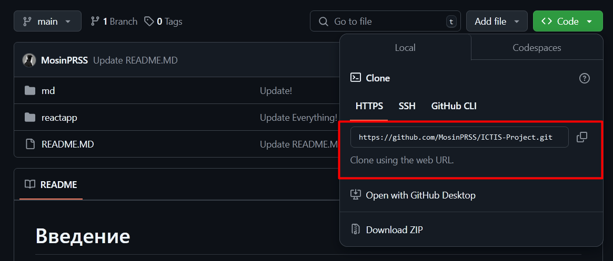

> [!WARNING]
> Пока не завершил этот ридми, может потом доделаю

# Введение
----------
## Требования
- **NodeJS** 

    *Необходим для запуска React-приложения.*

    Для большинства *Linux*-дистрибутивов идет в комплекте. Для *Windows*: [ссылка](https://nodejs.org/dist/v22.13.1/node-v22.13.1-x64.msi) (версия 22.13.1). Для проверки установки, откройте *Powershell* или *Bash*:
```powershell
npm --version # should output a npm version
```
- **Django // будет обновляться по мере требований**

    *Необходим для backend-части*

    Устанавливается с помощью pip / pipx
```python
pip install django djangorestframework 
```

- **Github Desktop / Git**

    *Для работы с репозиторием и его синхронизацией.*

    [Ссылка для Windows](https://desktop.github.com/download/)

    Для Linux используйте Flathub.


## Полноценное копирование приложение
- **Сам репозиторий**

    Войдите в *Github Desktop*, затем зажмите `Ctrl+Shift+O`:

    

    Выберите URL. На сайте Github найдите вкладку **Code**, затем скопируйте *ссылку* и вставьте ее в поле URL в Desktop-версии:

    

    Также, как могли заметить, вы могли сразу использовать опцию в **Code**: *Open with Github Desktop*. После копирования репозитория, вы можете использовать его в *Visual Studio Code* - для дополнительного взаимодействия с репозиторием __из VSC__ вам потребуется установить *[Git](https://git-scm.com/downloads/win)* (откроется функция Source Control `Ctrl + Shift + G`)

- **React-часть**
```powershell
cd reactapp # change directory to "react app" folder
npm install # requires NodeJS v21+ / npm v10.9.0
```

# Текущее состояние проекта
