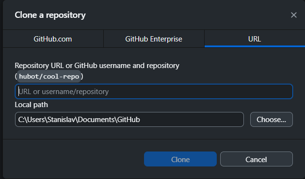

# Введение
----------
## Требования
- **NodeJS** 
<br>
*Необходим для запуска React-приложения.*
<br>
Для большинства *Linux*-дистрибутивов идет в комплекте.
<br>
Для *Windows*: [ссылка](https://nodejs.org/dist/v22.13.1/node-v22.13.1-x64.msi) (версия 22.13.1)
<br>
Для проверки установки, откройте *Powershell*:
<br>
```powershell
npm --version # should output a npm version
```
- **Django // будет обновляться по мере требований**
<br>
*Необходим для backend-части*
<br>
Устанавливается с помощью pip / pipx
<br>
```python
pip install django djangorestframework 
```


## Полноценное копирование приложение
- **Сам репозиторий**
<br>
Войдите в *Github Desktop*, затем зажмите `Ctrl+Shift+O`:
<br>

<br>

- **React-часть**
```powershell
cd reactapp # change directory to "react app" folder
npm install # requires NodeJS v21+ / npm v10.9.0
```

# Текущее состояние проекта
